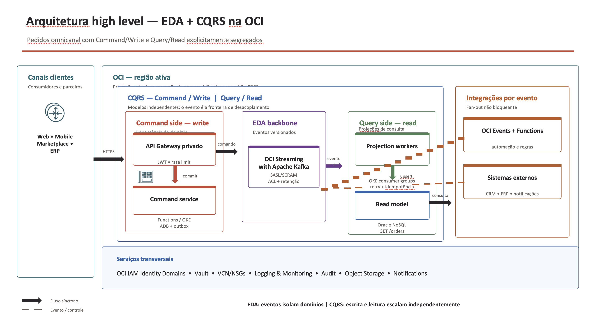
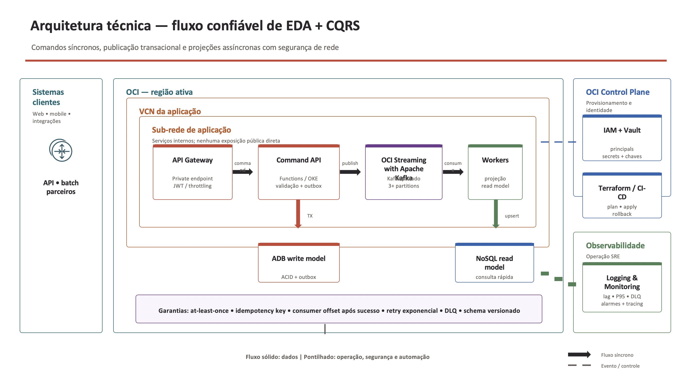
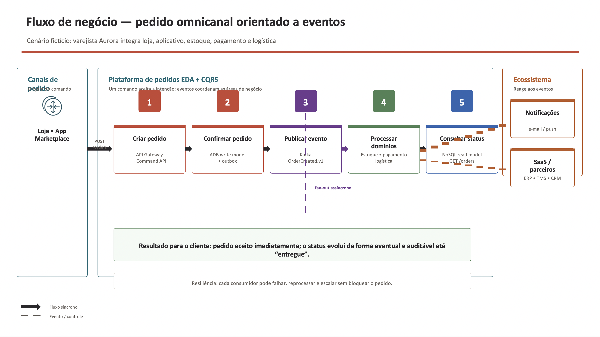

# EDA + CQRS na OCI

Implementação de referência de uma arquitetura orientada a eventos (EDA) com Command Query Responsibility Segregation (CQRS) na Oracle Cloud Infrastructure. Comandos síncronos validam e gravam o estado do domínio; a partir da confirmação transacional, eventos são publicados no **OCI Streaming with Apache Kafka** e projeções assíncronas atualizam modelos de leitura no Oracle NoSQL Database Cloud Service.

## EDA e CQRS

**EDA** desacopla os domínios de negócio por eventos versionados. Estoque, pagamento, logística, notificações e integrações externas reagem de forma independente a uma mudança de estado, sem transformar a API de pedidos em um ponto central de dependências.

**CQRS** separa as responsabilidades de escrita e leitura. O *Command/Write side* preserva consistência e regras de negócio no Autonomous Database; o *Query/Read side* mantém projeções específicas, escaláveis e otimizadas para consulta no Oracle NoSQL Database.

## Valor de negócio e técnico

- **Resiliência:** falhas ou lentidão em um consumidor, como logística, não bloqueiam o aceite do pedido. Reprocessamento, DLQ, idempotência e retenção dos eventos permitem recuperação controlada.
- **Escalabilidade:** APIs de comando, consumidores Kafka e projeções de leitura escalam de forma independente, acompanhando picos de canais digitais e consultas sem sobrecarregar o banco transacional.
- **Segurança:** os serviços permanecem privados na VCN, com API Gateway autenticado por JWT, IAM de mínimo privilégio, segredos no OCI Vault, NSGs restritivos e trilhas de auditoria centralizadas.
- **Evolução e integração:** novos consumidores podem ser adicionados a eventos existentes sem alterar o fluxo transacional do pedido, reduzindo acoplamento e acelerando a entrega de novas capacidades.

## Arquitetura High Level



## Arquitetura Técnica



## Fluxo de negócio de pedidos omnicanal



## Decisões de arquitetura

| Camada | Serviço | Decisão operacional |
|---|---|---|
| Entrada | API Gateway + OCI Functions | JWT/OAuth no gateway; funções privadas e com IAM de mínimo privilégio. |
| Write | Autonomous Database | Uma transação grava agregado + outbox. O publicador só emite eventos já confirmados. |
| Eventos | OCI Streaming with Apache Kafka | Cluster Kafka gerenciado, tópicos por domínio, chave = `aggregateId` e consumidores idempotentes. |
| Read | OCI Functions + Oracle NoSQL | Uma projeção por consumidor/grupo; upsert idempotente com `eventId` e versão. |
| Auditoria | Object Storage + Logging/Audit | Logs estruturados sem dados sensíveis; retenção e lifecycle definidos. |

> **Garantia realista:** OCI Streaming oferece entrega *at-least-once*. Portanto, não prometa "exactly once" entre banco e broker: use transactional outbox no write side e deduplicação no read side.

## Estrutura

- `terraform/`: fundação OCI (rede privada, Vault, Functions, Streaming, ADB, NoSQL, Object Storage e Log Group).
- `functions/command/`: exemplo de função que valida e grava comando/outbox.
- `functions/projection/`: exemplo de consumidor idempotente para projeções.
- `docs/PROVISIONAMENTO.md`: roteiro de implantação, IAM, gateway, CI/CD e operação.
- `docs/CONTRATOS_EVENTO.md`: contrato de eventos e regras de evolução.

## Início rápido

1. Siga os pré-requisitos e as decisões de capacidade em [docs/PROVISIONAMENTO.md](docs/PROVISIONAMENTO.md).
2. Crie seu arquivo local de variáveis:

```bash
cd terraform
cp terraform.tfvars.example terraform.tfvars
# Preencha os OCIDs, região e uma senha forte. Não versione terraform.tfvars.
terraform init
terraform fmt -check
terraform validate
terraform plan -out tfplan
terraform apply tfplan
```

3. Execute o SQL listado no guia no Autonomous Database, publique as imagens das funções no OCIR e configure o API Gateway com os endpoints gerados.

## Execução automatizada

Há um orquestrador em [scripts/provision.sh](scripts/provision.sh). Ele aplica o Terraform, schema ADB, Functions, deployment do gateway e o consumidor no OKE. Copie `scripts/provision.env.example` para `scripts/provision.env`, informe os valores reais e defina `APPLY=1`:

```bash
chmod +x scripts/provision.sh
scripts/provision.sh
```

Ele exige OCI CLI autenticado, Terraform, Fn CLI, SQLcl, `kubectl`, acesso ao OCIR, imagens imutáveis do publisher/consumer (`CONSUMER_IMAGE` e `PUBLISHER_IMAGE`) e um cluster OKE privado já entregue pela landing zone (`OKE_CLUSTER_OCID`). Como o Kafka é privado, execute-o em runner/bastion com rota para a VCN. A criação do cluster OKE e as policies globais de tenancy permanecem fora do script porque a configuração segura depende das regras corporativas de rede, versões Kubernetes aprovadas e administração da tenancy.

Para a explicação de negócio e o procedimento operacional completo, veja [CENARIO_NEGOCIO_E_EXECUCAO.md](docs/CENARIO_NEGOCIO_E_EXECUCAO.md).

O mesmo guia inclui uma seção dedicada à execução a partir da máquina local, incluindo VPN/bastion, OCI CLI, Fn/OCIR, SQLcl/ADB e acesso ao OKE privado.

Antes do deploy produtivo, execute o runbook de [pré-requisitos de segurança](docs/PRE_REQUISITOS_SEGURANCA.md).

O Terraform **não** cria usuários, senhas ou tokens de Streaming: segredos devem entrar no Vault/OCIR via pipeline ou `oci vault secret create`, nunca em `.tfvars`, código, logs ou estado Terraform.

## Limites deliberados

Este repositório entrega a fundação e o código de domínio sem assumir nomes de tenancy, OCIDs, política corporativa de identidade ou capacidade de produção. O gateway é configurado após o deploy das funções porque o URL de invoke é um artefato de release; o roteiro traz uma especificação OpenAPI parametrizada. O backbone adotado é **OCI Streaming with Apache Kafka**: cluster Kafka gerenciado em sub-rede privada, configuração explícita e tópicos criados por admin client.

Consulte também a documentação oficial de [OCI Streaming](https://docs.oracle.com/en-us/iaas/Content/Streaming/Concepts/streamingoverview.htm), [Kafka gerenciado](https://docs.oracle.com/en-us/iaas/Content/kafka/overview.htm), [OCI Functions](https://docs.oracle.com/en-us/iaas/Content/Functions/Tasks/functionscreatingapps-task.htm) e [provider Terraform OCI](https://docs.oracle.com/en-us/iaas/tools/terraform-provider-oci/latest/index.html).
