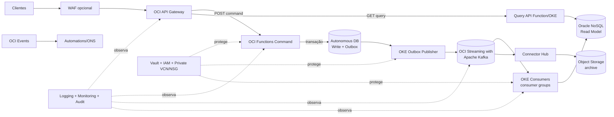

# Arquitetura de produção: EDA + CQRS na OCI

## 1. Visão geral da solução

**Suposição:** uma API transacional (pedidos, cadastros, pagamentos ou caso semelhante) sofre picos de escrita, precisa propagar mudanças para várias visões/integrações e aceita que consultas reflitam a alteração alguns segundos depois. EDA + CQRS separa a decisão/consistência forte do agregado (write model) da leitura otimizada e escalável. Não use CQRS para um CRUD pequeno sem projeções, alto volume ou integrações assíncronas: a complexidade operacional não se paga.

Escolha principal: **API Gateway → OCI Functions → Autonomous Database + outbox → OCI Streaming with Apache Kafka → consumidores em OKE → Oracle NoSQL/read store → API Gateway**. Functions é ideal para comandos curtos e irregulares; consumidores Kafka são processos contínuos e, por isso, OKE é a escolha principal para controlar `consumer groups`, conexões long-lived e autoscaling. O requisito desta implementação é Kafka 100% compatível, portanto o backbone é **OCI Streaming with Apache Kafka** gerenciado, em vez do OCI Streaming serverless.

| Serviço | Papel |
|---|---|
| API Gateway | Borda HTTP, JWT/OAuth2, CORS, rate limiting, roteamento para funções. |
| Functions | Command API sem servidor; valida, autoriza e grava agregado + outbox. |
| OKE | Consumidores contínuos, publicador da outbox e consultas de maior duração. |
| Streaming/Kafka | Log de eventos particionado, replay e desacoplamento. |
| Autonomous Database | Fonte de verdade transacional do command side. |
| NoSQL | Read model de baixa latência e escala por chave; use ADB read replica/materialized view se consultas relacionais dominarem. |
| Events/Connector Hub | Reage a eventos de recursos OCI e roteia cópias/integrações; não substitui Kafka para eventos de domínio. |
| Vault | Chaves KMS, senhas, auth tokens e certificados. |
| Logging/Monitoring/Notifications | Telemetria, SLOs, alarmes e escalonamento. |
| Object Storage | Arquivo imutável, DLQ exportada, logs e backup auxiliar. |

## 2. Arquitetura alvo e fluxo

1. Cliente autentica no provedor OIDC e envia comando pelo API Gateway com JWT, `Idempotency-Key` e `traceparent`.
2. Gateway valida token/escopo e limita tráfego; OCI Function valida regra de negócio.
3. Em uma transação ADB, a função grava o agregado, comando idempotente e registro de outbox. Responde `202` — não espera projeções.
4. Um deployment OKE lê a outbox com lock, publica no tópico Kafka `<projeto>.<ambiente>.orders.domain.v1` usando `aggregateId` como chave e marca o registro publicado após ACK.
5. Cada consumer group processa o mesmo evento de forma independente: projeção NoSQL, integrações/SaaS, arquivo no Object Storage e notificações. Connector Hub pode fan-out do Streaming para destinos OCI; OCI Events é usado para eventos nativos da plataforma (por exemplo, Object Storage) e automações.
6. A consulta chega ao gateway e lê exclusivamente o read model. Se a projeção ainda não alcançou o evento, retorna a versão disponível e, se necessário, `X-Projection-Lag`; não leia o write model como atalho.

A consistência é **eventual** entre ADB e read model. Ela é controlada por outbox transacional, publicação idempotente, offset confirmado após persistência e deduplicação por `eventId`. Os modelos permanecem desacoplados porque compartilham o contrato de evento, não tabelas, credenciais nem chamadas síncronas.

## 3. Passo a passo de provisionamento

### Pré-requisitos

- Landing zone OCI, tenancy, região, tags obrigatórias, limites de serviço e centro de custo aprovados.
- Domínio DNS, IdP OIDC, grupos IAM e decisão de RTO/RPO, retenção e classificação de dados aprovados.
- Terraform >= 1.6, OCI CLI, Docker, Fn CLI, `kubectl`, Helm e acesso ao OCIR. Credenciais Terraform por instance/resource principal ou profile local; nunca chave privada em repositório.
- Capacidade: TPS de comandos, tamanho médio de evento, retenção, número de projeções, p95 de latência e crescimento. Partições são dimensionadas pelo maior entre throughput e paralelismo desejado; não as altere sem testar ordenação/consumer rebalance.

### Sequência e dependências

| Ordem | Crie/configure | Depende de | Configuração essencial / motivo |
|---:|---|---|---|
| 0 | Compartments `platform`, `app-dev/hml/prd`, `security`, `observability` | tenancy | Isola quota, custo e políticas. Produção em compartment próprio. |
| 1 | IAM groups/dynamic groups/policies | compartments | Humanos por grupo; workloads por dynamic group; mínimo privilégio. |
| 2 | VCN, sub-redes privadas regionais, NSG, Service Gateway, NAT/DRG | compartment | Funções/nós sem IP público. NAT somente se dependência externa exigir; NSG, não security list ampla. |
| 3 | Vault, KMS key, secrets, certificados | IAM/rede | Chave por ambiente/classificação; rotação; secret references nos workloads. |
| 4 | Logging log groups, métricas/alarms, Notification topics, Audit retention | IAM | Existe antes da aplicação para capturar provisionamento e erros iniciais. |
| 5 | ADB e schemas | rede/Vault | ADB privado se política exigir; backup automático e usuário de aplicação sem `ADMIN`. |
| 6 | Cluster OCI Streaming with Apache Kafka, tópicos/ACLs e Schema Registry | Vault/IAM/rede | Cluster privado HA, tópicos, partições, autenticação, DLQ e quotas. |
| 7 | NoSQL tables/read indexes; bucket Object Storage lifecycle | Vault/IAM | Chave de partição alinhada às consultas; bucket privado, versionado e criptografado. |
| 8 | OKE privado, node pools/Workload Identity ou Functions apps | rede/IAM/OCIR | Consumidores em deployment; funções em subnet privada. |
| 9 | Imagens OCIR, publicador outbox, command/query APIs e migrations | 5–8 | CI assina/escaneia imagem e executa migration compatível antes do deploy. |
| 10 | API Gateway/deployment, DNS/WAF opcional e IdP | APIs | Rotas somente após backend saudável; JWT e rate limit por rota. |
| 11 | Connector Hub, regras OCI Events e integrações | stream/bucket/functions | Filtros específicos e DLQ; não crie regra ampla que gere loop. |
| 12 | Testes, game day, runbooks, dashboards, aprovação go-live | todos | Execute testes de falha/replay/DR e valide SLO/custo. |

### Aplicação da fundação Terraform

O diretório `terraform/` cria a fundação demonstrativa. Antes de `apply`, ajuste CIDRs, tenancy/compartment, tags, ADB e retenção. O estado deve ficar em backend remoto protegido (OCI Object Storage com versionamento, lock e acesso apenas à pipeline); o exemplo não fixa backend para evitar apontar para um bucket inexistente.

```bash
cd terraform
cp terraform.tfvars.example terraform.tfvars
terraform init && terraform fmt -check && terraform validate
terraform plan -out=tfplan
terraform apply tfplan
```

Após a fundação, crie o schema transacional:

```sql
CREATE TABLE orders (order_id VARCHAR2(64) PRIMARY KEY, customer_id VARCHAR2(64) NOT NULL,
  status VARCHAR2(30) NOT NULL, version NUMBER NOT NULL, created_at TIMESTAMP WITH TIME ZONE NOT NULL);
CREATE TABLE commands (idempotency_key VARCHAR2(128) PRIMARY KEY, event_id VARCHAR2(36) NOT NULL);
CREATE TABLE outbox (event_id VARCHAR2(36) PRIMARY KEY, topic VARCHAR2(200) NOT NULL,
  event_key VARCHAR2(200) NOT NULL, payload CLOB NOT NULL, status VARCHAR2(20) NOT NULL,
  created_at TIMESTAMP WITH TIME ZONE NOT NULL, published_at TIMESTAMP WITH TIME ZONE);
CREATE INDEX outbox_pending_ix ON outbox(status, created_at);
CREATE TABLE processed_events (event_id VARCHAR2(36) PRIMARY KEY, processed_at TIMESTAMP WITH TIME ZONE NOT NULL);
CREATE TABLE order_read_model (order_id VARCHAR2(64) PRIMARY KEY, customer_id VARCHAR2(64),
  version NUMBER NOT NULL, payload CLOB, updated_at TIMESTAMP WITH TIME ZONE NOT NULL);
```

Em produção, a projeção deve gravar no NoSQL, não nesta tabela de exemplo. Use a tabela ADB acima apenas para validar localmente o consumidor fornecido.

## 4. Configuração detalhada por serviço

### API Gateway

Finalidade: borda de `POST /v1/orders` e `GET /v1/orders/{id}`. Use gateway público atrás de WAF se clientes externos, ou privado via VCN para B2B interno. Configure JWT validation pelo issuer/audience, scopes distintos `orders.write` e `orders.read`, CORS estrito, request validation, tamanho máximo, timeouts e rate limit por cliente. Não coloque segredo no spec. Riscos: confiar na autorização somente do gateway, CORS `*`, backends públicos e timeout que cause reenvio sem idempotência. HA é regional; distribua entre regiões somente se RTO exigir.

### OCI Functions e OKE

Functions: comando curto, stateless, 512 MB/30 s no exemplo; configure concurrency/memória após teste e subnet privada regional. OKE: consumers, outbox publisher e query API com conexões persistentes. OKE privado, node pools multi-AD/FD, autoscaler/HPA por lag de consumer, PodDisruptionBudget, requests/limits e imagens imutáveis por digest. Use workload identity/dynamic group ou CSI Secrets Store com Vault; não use kubeconfig ou tokens estáticos no pod. Risco comum: Functions para poll Kafka infinito; use OKE para isso.

### OCI Streaming with Apache Kafka

Use OCI Streaming with Apache Kafka: o Terraform cria cluster privado e o script cria os tópicos explicitamente. Produção exige tipo `PRODUCTION` e pelo menos três brokers; configure TLS/SASL, credencial de superusuário em Vault, ACLs por produtor/consumer, `acks=all`, idempotência, `min.insync.replicas=2`, compressão e quotas. Use chave estável `aggregateId`; partições só aumentam. Crie `*.retry.v1`/`*.dlq.v1`, alarmes de lag e política de replay. Nunca use offset como idempotência; ele muda por tópico/replay.

### Autonomous Database

Write model de consistência transacional. Separe `ADMIN`, migration e application users; TLS/mTLS e wallet no Vault; connection pooling. Configure backup automático, retenção conforme RPO, patching window, autoscaling de CPU apenas após teste de custo, private endpoint quando aplicável e Data Guard/cross-region para RTO/RPO exigentes. Índices para `outbox(status,created_at)` e transações curtas. Riscos: publicar mensagem dentro da transação sem outbox, usar `ADMIN` e guardar wallet no container.

### Oracle NoSQL Database

Read model só faz sentido quando acessos são por chave/documento com baixa latência e grande escala. Modele a PK pela consulta (`tenantId`/`orderId`), evite hot keys, use TTL para dados transitórios e índices secundários conscientemente. Use conditional put/version para projeções; armazene `eventId`/versão. Para joins, relatórios e filtros relacionais, mantenha uma projeção ADB/Analytics em vez de forçar NoSQL. Planeje capacidade/on-demand e alarmes de throttling; criptografia/IAM e endpoints privados quando suportados.

### OCI Events e Connector Hub

OCI Events recebe eventos de recursos OCI (Object Storage, lifecycle etc.) e aciona Function, Notifications ou Streaming. Connector Hub recebe Streaming e pode transformar por Function/entregar a Object Storage. Use filtros mínimos por compartment/resource/event type, tags de correlação e destinos com DLQ. Não use OCI Events como bus de domínio: não fornece o contrato, ordering e replay do Kafka. Evite loops (bucket → event → grava no mesmo bucket).

### Vault

Cofre e key por ambiente/criticidade; chaves HSM onde necessário, rotação de secret/certificado e políticas de leitura somente ao dynamic group exato. Use secret OCIDs, não valores, em configuração. Audite uso de chave/secret. Riscos: secret em Terraform state, `.tfvars`, imagem Docker, variable de log ou shared vault sem segregação.

### IAM, rede e compartments

Use compartments por ambiente, grupos para pessoas e dynamic groups para Functions/OKE. Policies verbosas são preferíveis a `manage all-resources`. VCN regional, sub-redes privadas separadas (ingress, workload, dados), NSGs por fluxo, Service Gateway para OCI e NAT apenas para egress externo controlado; DRG/firewall para on-premises. Habilite Cloud Guard/Security Zones se disponíveis. A API de Functions continua ter endpoint de invoke: controle-a em IAM, não suponha que subnet privada sozinha resolve isso.

### Logging, Monitoring e Notifications

Crie log groups por ambiente e serviço, logs estruturados JSON com `correlationId`, `traceId`, `eventId`, tipo e latência, mascarando PII. Métricas: 4xx/5xx/latência gateway, erro/duração/concurrency Functions, lag/rebalance/DLQ Kafka, CPU/conexões/erro ADB, throttling NoSQL e idade da outbox. Alarmes devem notificar canal com escalonamento; dashboards SLO e auditoria OCI Audit são mandatórios. Exporte logs relevantes a Object Storage com retenção/lifecycle.

### Object Storage

Bucket privado sem acesso público, versionamento, criptografia Vault se requisito, retention rule/WORM para auditoria e lifecycle Standard → Infrequent Access → Archive. Use pre-authenticated request somente temporário e de escopo mínimo. É o destino para arquivo/replay/auditoria; não é banco de consulta em tempo real.

## 5. e 6. Contratos e código

Os exemplos prontos estão em [CONTRATOS_EVENTO.md](CONTRATOS_EVENTO.md), [functions/command/func.py](../functions/command/func.py), [functions/projection/consumer.py](../functions/projection/consumer.py) e `terraform/`. O consumidor demonstra a semântica correta de commit após escrita; troque o read store ADB de demonstração pelo SDK NoSQL no ambiente final.

### API Gateway: especificação base (`gateway/openapi.yaml`)

```yaml
openapi: 3.0.3
info: {title: orders-api, version: '1.0'}
paths:
  /v1/orders:
    post:
      operationId: createOrder
      security: [{oauth2: [orders.write]}]
      parameters: [{in: header, name: Idempotency-Key, required: true, schema: {type: string}}]
      responses: {'202': {description: Accepted}, '400': {description: Invalid command}}
      x-oci-backend:
        type: ORACLE_FUNCTIONS_BACKEND
        functionId: ${COMMAND_FUNCTION_OCID}
  /v1/orders/{id}:
    get:
      operationId: getOrder
      security: [{oauth2: [orders.read]}]
      parameters: [{in: path, name: id, required: true, schema: {type: string}}]
      responses: {'200': {description: OK}, '404': {description: Not found}}
      x-oci-backend:
        type: ORACLE_FUNCTIONS_BACKEND
        functionId: ${QUERY_FUNCTION_OCID}
components:
  securitySchemes:
    oauth2: {type: oauth2, flows: {clientCredentials: {tokenUrl: https://idp.example/token, scopes: {orders.write: write, orders.read: read}}}}
```

Valide a sintaxe `x-oci-backend` na versão do API Gateway da sua região antes de aplicar; substitua o placeholder pelo OCID retornado pelo deploy da função e configure issuer/audience/JWKS no deployment.

### IAM: política exemplar (`iam/policies.txt`)

```text
Allow dynamic-group edacqrs-prd-command-dg to use vault-secrets in compartment app-prd
Allow dynamic-group edacqrs-prd-command-dg to use keys in compartment security where target.key.id = '<key-ocid>'
Allow dynamic-group edacqrs-prd-command-dg to use streams in compartment app-prd
Allow dynamic-group edacqrs-prd-consumer-dg to use streams in compartment app-prd
Allow dynamic-group edacqrs-prd-consumer-dg to read nosql-tables in compartment app-prd
Allow service apigateway to use functions-family in compartment app-prd
Allow group edacqrs-prd-deployers to manage functions-family in compartment app-prd
```

Substitua pelo menor verbo/recurso que o serviço efetivamente requer e teste com identidade de workload. Policies de ADB são complementadas por usuários e grants SQL.

### Event routing: regra OCI Events (`events/rule.json`)

```json
{
  "displayName": "edacqrs-prd-object-created",
  "condition": "{\"eventType\":\"com.oraclecloud.objectstorage.createobject\",\"data\":{\"resourceName\":\"edacqrs-prd-event-archive\"}}",
  "actions": [{"actionType": "ONS", "isEnabled": true, "description": "Alertar sobre arquivo novo", "topicId": "<ONS_TOPIC_OCID>"}]
}
```

Crie-a no compartment do bucket e troque `ONS` por Function somente quando houver processamento necessário. Eventos de domínio continuam no Kafka.

## 7. Estratégia de operação

- **SLO/telemetria:** trace distribuído OpenTelemetry da borda ao consumer; propague `traceparent`. Mantenha dashboard de p95, taxa de erro, lag/idade de outbox e DLQ. Page para indisponibilidade, ticket para capacidade.
- **Backup/DR:** backup automático ADB e restore trimestral testado; políticas Object Storage e export de configurações IaC; retenção Kafka definida pelo replay máximo. Para desastre regional, plano ativo-passivo com replicação do write model/cluster quando RTO/RPO justificar; ensaie failover e reconciliação de eventos.
- **Deploy/rollback:** pipeline executa fmt/validate, scan de IaC/imagem, testes, migration expand-only, canary/blue-green e smoke test. Rollback de código é por imagem imutável; schema/evento não é apagado — use migração compensatória/forward fix. Pause consumers antes de mudança incompatível.
- **Schemas:** Schema Registry, compatibilidade backward, evento imutável, `eventVersion` major. Consumidor tolera campos desconhecidos e defaults; faça dual-read/dual-publish em migração.
- **Testes:** unitários de domínio, contract tests producer/consumer, Testcontainers/Kafka em CI, integração OCI em ambiente isolado, carga do gateway e consumer lag, caos (duplicata, crash entre gravação/commit, indisponibilidade ADB/Kafka), replay e restore.

## 8. Checklist de produção

- [ ] OCIDs, CIDRs, quotas, tags/custos, RTO/RPO, retenção e classificação de dados aprovados.
- [ ] Compartments isolados; IAM de mínimo privilégio validado por workload; nenhuma credencial em código/estado/log.
- [ ] Sub-redes privadas, NSGs restritos, egress controlado, TLS, Vault/rotação e WAF/IdP configurados.
- [ ] Outbox, chave idempotente, DLQ, retry com jitter, deduplicação e ordenação por agregado testados.
- [ ] Partições, consumer groups, ADB/NoSQL capacity, autoscaling e quotas testados sob carga.
- [ ] Logs estruturados, Audit, dashboards, alarmes, ONS/on-call, tracing e runbooks ativos.
- [ ] Backup/restore, replay, DLQ, failover regional e rollback de deploy ensaiados.
- [ ] API contract/schema compatibility, migrations e PII/LGPD revisados.
- [ ] Alertas de custo, lifecycle Object Storage, capacidade e retenção revisados.

## 9. Revisão de produção: decisões pendentes e riscos

1. Definir volumes, RTO/RPO, versão Kafka e tipo de coordenação disponível na região: esses valores definem a forma e a topologia DR do cluster gerenciado.
2. Definir IdP, público/privado do gateway e conectividade ADB para concluir regras de rede e JWT.
3. Confirmar padrões de consulta: NoSQL é recomendado apenas se a leitura for key/document-oriented; relatórios demandam outra projeção.
4. Confirmar classificação LGPD, KMS HSM, retenção legal e residência de dados.
5. O Terraform é fundação inicial: antes de produção, valide recursos/atributos contra a versão fixada do provider em uma pipeline e mova state/senhas para backend/secret manager. Não aplique o exemplo com senha em `terraform.tfvars`.


